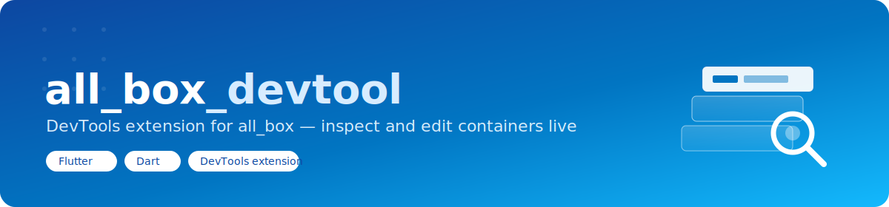
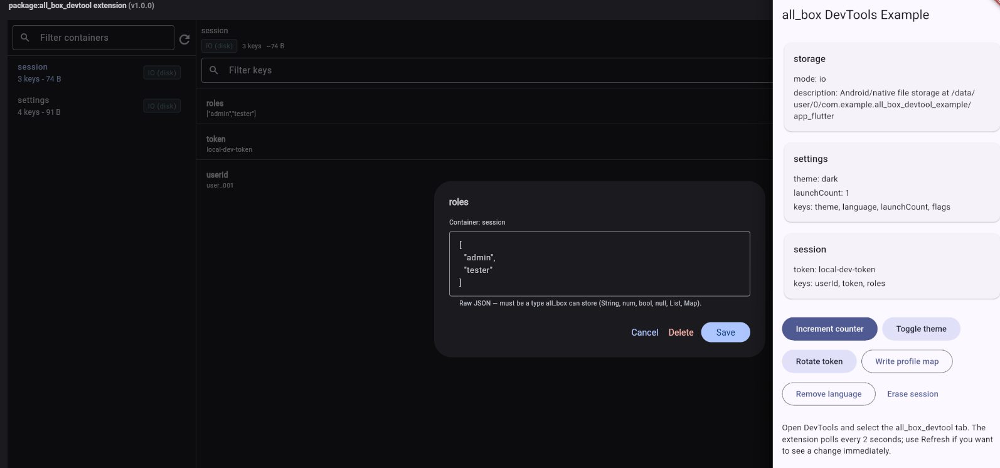
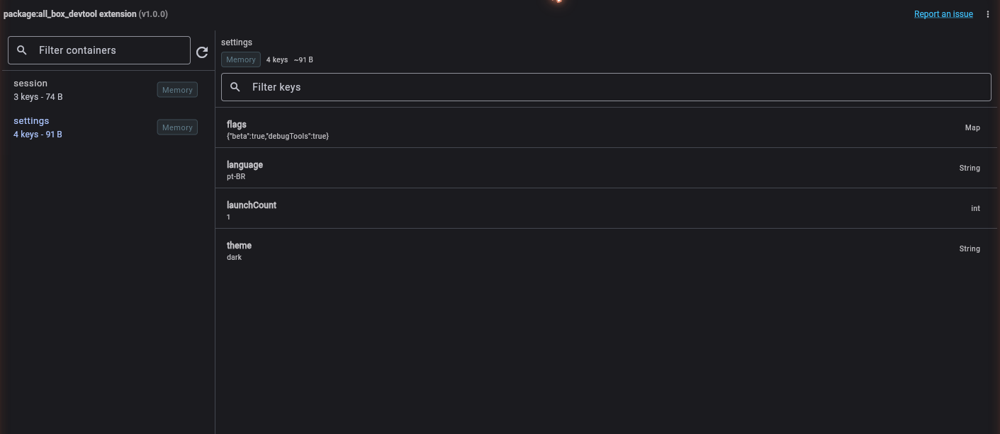
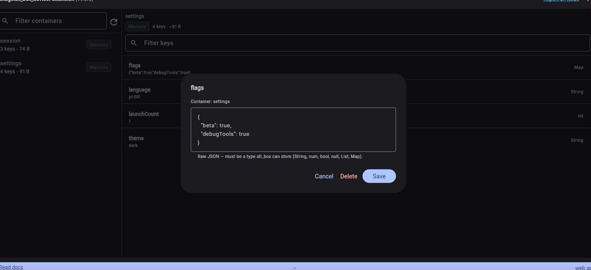

<p align="center">
  
</p>

<p align="center">
  
</p>

<h1 align="center">all_box_devtool</h1>

<p align="center">
🇧🇷 <a href="https://github.com/CriandoGames/all_box_devtool/blob/main/README.pt-BR.md">Português</a> | 🇺🇸 English
</p>

<p align="center">
  <a href="https://github.com/CriandoGames/all_box_devtool/blob/main/LICENSE"></a>
  
  
</p>

<p align="center">
💡 A <a href="https://docs.flutter.dev/tools/devtools/extensions">DevTools extension</a> for <a href="https://pub.dev/packages/all_box"><code>all_box</code></a>: browse and edit <code>AllBox</code> containers straight from Flutter/Dart DevTools.
</p>

## Table of contents

- [Features](#-features)
- [Requirements](#-requirements)
- [Step-by-step setup](#-step-by-step-setup)
- [Usage](#-usage)
- [How it works](#️-how-it-works)
- [Additional information](#-additional-information)

## 🚀 Features

- 🔍 **Containers list.** Every `AllBox` container currently alive in the
  inspected app, filterable by name, with backend/pending-flush badges.
- 📄 **Container detail.** A selected container's keys and values,
  filterable by key name, plus a storage summary (backend, key count,
  approximate size).
- ✏️ **Edit in place.** Tap a key to view it, edit it as raw JSON, or
  delete it — writes go straight to the running app through the VM
  Service.
- 🔁 **Polling refresh.** The panel refreshes automatically every 2
  seconds, plus a manual refresh button. `all_box` 0.6.0 does post
  debug-only VM Service mutation events on write/remove/erase, but this
  extension doesn't consume them yet (see
  [How it works](#️-how-it-works)) — refreshing is pull-based for now.
- 🧯 **Debug/profile only.** `all_box`'s introspection (`AllBoxInspector`)
  is a no-op in release builds — nothing here adds runtime overhead to a
  shipped app, and there's nothing to see in a release build's DevTools
  session, by design.

## 📋 Requirements

The app you're debugging must depend on:

```yaml
dependencies:
  all_box: ^0.7.0
```

`all_box` 0.6.0 is what introduced `AllBoxInspector` — the debug-only,
read-only introspection surface this extension reads through the VM
Service. This extension is compatible with newer `all_box` releases too;
use `^1.0.0-beta.2` explicitly if you want to validate the beta IndexedDB
Web backend.

## 📦 Step-by-step setup

1. In the app that uses `all_box`, make sure `pubspec.yaml` has `all_box`
   in `dependencies` and `all_box_devtool` in `dev_dependencies`:

   ```yaml
   dependencies:
     all_box: ^0.7.0

   dev_dependencies:
     all_box_devtool: ^1.0.1
   ```

   To test the current beta channel instead, use:

   ```yaml
   dependencies:
     all_box: ^1.0.0-beta.2
   ```

2. Run:

   ```sh
   flutter pub get
   ```

3. Start the app in `debug` or `profile` mode:

   ```sh
   flutter run
   ```

4. Open Flutter/Dart DevTools from your IDE or from the URL printed in
   the terminal.
5. On first use, enable the `all_box_devtool` extension when DevTools asks
   for permission.
6. Open the "all_box_devtool" tab.
7. Select a container to inspect its keys, edit values as raw JSON, or
   remove entries.

For more details about extension permissions, see the official docs:
[Use a DevTools extension](https://docs.flutter.dev/tools/devtools/extensions#use-a-devtools-extension).

## 🧪 Usage

Once enabled, a new "all_box_devtool" tab appears in DevTools while your
app is running.

- Select a container on the left to inspect its keys on the right.
- Type in either search field to filter containers or keys.
- Tap any key to view, edit (as raw JSON), or delete it.
- Use the refresh button, or just wait — the panel polls every 2 seconds
  on its own.

<p align="center">
  
</p>

<p align="center">
  
</p>

## 🛠️ How it works

- The extension talks to the inspected app only through the VM Service —
  it evaluates `AllBoxInspector.snapshotAsJson()` (and, for writes,
  `AllBox(container).write(...)`/`.remove(...)`) in the app's main
  isolate. No package is added to the inspected app's own dependency
  graph beyond `all_box` itself.
- `all_box` has no built-in *Dart-visible* reactivity by design (see its
  own [README](https://github.com/CriandoGames/all_box#-need-reactivity)).
  As of `all_box` 0.6.0 it also posts a debug-only VM Service extension
  event (`all_box:mutation`) after every write/remove/erase, aimed
  exactly at tooling like this — but this extension doesn't listen for it
  yet, so it stays pull-based for now: a `PollingController` refreshes
  every 2 seconds, and every write/delete triggers an immediate extra
  refresh so the UI reflects your own edits right away.
- Full design rationale, folder-by-folder responsibilities, and the
  reasoning behind each decision: [ARCHITECTURE.md](./ARCHITECTURE.md).

## 📚 Additional information

- Architecture and design notes: [ARCHITECTURE.md](./ARCHITECTURE.md).
- `all_box`: <https://github.com/CriandoGames/all_box>.
- Issues: <https://github.com/CriandoGames/all_box_devtool/issues>.

---

Issues and pull requests are welcome at the
[GitHub repository](https://github.com/CriandoGames/all_box_devtool).
